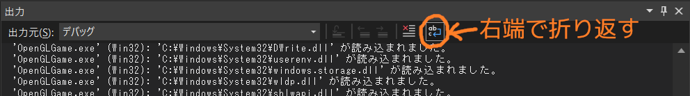

# OpenGLGame
-tn-mai講師に習ったことをout-putする場所-

[tn-mai講師:今年度のtext](https://github.com/tn-mai/OpenGL3D2023)

## 1.プロジェクトの作成
VisualStudioの起動

->`新しいプロジェクトの作成`をクリック

->`空のプロジェクト`を選択

->`次へ`をクリック

->プロジェクト名と保存場所の設定

->`作成`をクリック

## 2.機能設定
プロジェクトを選択

->alt + enter

->構成を`すべての構成`に

->プラットフォームを`すべてのプラットフォーム`に

->構成プロパティ\全般のC++言語標準を

　`ISO C++20標準(/std:c++20)`に

->構成プロパティ\詳細の文字セットを

　`マルチバイト文字セットを使用する`に

->構成プロパティ\リンカー\システムのサブシステムを

　`Windows(/SUBSYSTEM:WINDOWS)`に

->`適用`をクリック

->`OK`をクリック

## 3.OpenGLの導入
プロジェクトを選択

->`NuGetパッケージの管理`をクリック

->`参照`をクリック

->検索boxに`glfw`を入力

->`glfw`を選択

->`インストール`をクリック

->`OK`をクリック

## 4.ウィンドウの作成
プロジェクトの選択

->ctrl + shift + A

->`プロジェクト名\Src\Main.cpp`を入力

->`追加`をクリック

`Main.cpp`
```diff
+/**
+* @file Main.cpp
+*/
+#include <GLFW/glfw3.h> // GLFWライブラリの関数が定義されているヘッダファイル
+#include <Windows.h>    // ウィンドウズ用の関数が定義されているヘッダファイル
+#include <string>       // 文字列型や文字列操作関数などが定義されているヘッダファイル
+
+/// <summary>
+/// エントリーポイント
+/// </summary>
+int WINAPI WinMain
+(
+    _In_ HINSTANCE hInstnce,
+    _In_opt_ HINSTANCE hPrevInstance,
+    _In_ LPSTR lpCmdLine,
+    _In_ int nShowCmd
+)
+{
+#pragma region GLFWライブラリの初期化
+    // 初期化に成功しなかった(!GLFW_TRUE)時,
+    // 1を返して終了
+    if (glfwInit() != GLFW_TRUE)
+    {
+        return 1; // 初期化失敗
+    }
+#pragma endregion
+
+#pragma region 描画ウィンドウの作成
+    GLFWwindow* window = nullptr;           // ウィンドウオブジェクト
+    const std::string title = "OpenGLGame"; // ウィンドウタイトル
+    window = 
+        //グラフィックス描画用ウィンドウの作成
+        glfwCreateWindow
+        (
+            1280,           // ウィンドウの幅
+            720,            // ウィンドウの高さ
+            title.c_str(),  // タイトルバーに表示する文字列
+            nullptr,        // 表示するモニタの選択
+            nullptr         // リソースを共有するウィンドウ
+        );
+    // ウィンドウの作成に成功しなかった(nullptr)時,
+    // 1を返して終了
+    if (!window)
+    {
+        // GLFWライブラリの終了
+        glfwTerminate();
+        return 1;   // ウィンドウ作成失敗
+    }
+#pragma endregion
+
+#pragma region OpenGL関数の導入
+    // OpenGLコンテキストの作成
+    // 引数 : GLFWウィンドウオブジェクトのアドレス
+    glfwMakeContextCurrent(window);
+#pragma endregion
+
+#pragma region メインループの定義
+    // ウィンドウの終了要求が来ていなかった(0)時,
+    // メインループ処理を続ける
+    // 引数 : GLFWwindowへのポインタ
+    while (!glfwWindowShouldClose(window))
+    {
+        // バックバッファの描画終了時,
+        // フロントバッファと役割の交換
+        // 引数 : GLFWwindowへのポインタ
+        glfwSwapBuffers(window);
+
+        // 「OSからの要求」の処理
+        // (キーボードやマウスなどの状態を取得するなど)
+        glfwPollEvents();
+    }
+#pragma endregion
+
+#pragma region GLFWライブラリの終了
+    glfwTerminate();
+#pragma endregion
+
+    return 0;
+}
```

## 5.OpenGL関数の試用

[GLADのダウンロードページ](https://glad.dav1d.de/)

ダウンロードページの起動

->Specificationを`OpenGL`に

->APIのglを`Version4.5`に

->Profileを`Compatibility`に

->Optionsの`Generate a loader`をチェック

->`GENERATE`をクリック

->`glad.zip`をダウンロード

->`プロジェクト名/Src/glad`に`glad.zip`を展開

->(VisualStudio)ソースファイルを選択

->右クリック,追加,`新しいフィルター`を選択

->名前を`glad`に

->プロジェクトの選択

->alt + enter

->構成プロパティ\C/C++\全般の

　追加のインクルードディレクトリのvの`編集`をクリック

->テキストボックスに`$(ProjectDir)Src\glad\include`を入力

->`OK`をクリック

`Main.cpp`
```diff
 /**
 * @file Main.cpp
 */
+#include "glad/glad.h"  // GLADライブラリの関数が定義されているヘッダファイル
 #include <GLFW/glfw3.h> // GLFWライブラリの関数が定義されているヘッダファイル
 #include <Windows.h>    // ウィンドウズ用の関数が定義されているヘッダファイル
 #include <string>       // 文字列型や文字列操作関数などが定義されているヘッダファイル
```
```diff
 #pragma region OpenGL関数の導入
     // OpenGLコンテキストの作成
     // 引数 : GLFWウィンドウオブジェクトのアドレス
     glfwMakeContextCurrent(window);
 
+    // gladLoadGLLoader : 必要な関数のアドレスを全て取得
+    // glfwGetProcAddress : OpenGL関数名に対応する関数のアドレスを返す
+    if (!gladLoadGLLoader(reinterpret_cast<GLADloadproc>(glfwGetProcAddress)))
+    {
+        // GLFWライブラリの終了
+        glfwTerminate();
+        return 1; // アドレス取得失敗
+    }
 #pragma endregion
 
 #pragma region メインループの定義
     // ウィンドウの終了要求が来ていなかった(0)時,
     // メインループ処理を続ける
     // 引数 : GLFWwindowへのポインタ
     while (!glfwWindowShouldClose(window))
     {
+        // バックバッファを消去するときに使用する色を指定
+        glClearColor
+        (
+            0.3f,   // R(赤)
+            0.6f,   // G(緑)
+            0.9f,   // B(青)
+            1.0f    // A(透明度)
+        );
+        // バックバッファをクリア
+        // GL_COLOR_BUFFER_BIT : カラーバッファ(色)
+        // GL_DEPTH_BUFFER_BIT : 深度バッファ(奥行き)
+        // GL_STENCIL_BUFFER_BIT : ステンシルバッファ(切り抜き)
+        glClear(GL_COLOR_BUFFER_BIT | GL_DEPTH_BUFFER_BIT);
 
         // バックバッファの描画終了時,
         // フロントバッファと役割の交換
         // 引数 : GLFWwindowへのポインタ
         glfwSwapBuffers(window);
```

## 課題01
内容

glClearColorの引数を変更して,

描画ウィンドウを青色(または好きな色)で塗りつぶしなさい.

`Main.cpp`
```C++
glClearColor
(
    0.3f,   // R(赤)
    0.6f,   // G(緑)
    0.9f,   // B(青)
    1.0f    // A(透明度)
);
```
を変える

## 6. 図形の描画
OpenGLで図形を描画するには...
>* 頂点データ: 頂点の座標や法線など.<br>
>* インデックスデータ: 図形を構成する頂点の番号.<br>
>* 頂点データ形式: 頂点データの解釈方法.<br>

`Main.cpp`
```diff
     // gladLoadGLLoader : 必要な関数のアドレスを全て取得
     // glfwGetProcAddress : OpenGL関数名に対応する関数のアドレスを返す
     if (!gladLoadGLLoader(reinterpret_cast<GLADloadproc>(glfwGetProcAddress)))
     {
         // GLFWライブラリの終了
         glfwTerminate();
         return 1; // アドレス取得失敗
     }
 #pragma endregion
 
+#pragma region 頂点データをGPUメモリにコピー
+    // 頂点データ(x,y,z座標が-1~+1の座標系における座標)
+    const float vertexData[][3] =
+    {
+        {-0.2f,-0.2f, 0}, { 0.2f,-0.2f, 0}, { 0.0f, 0.2f, 0},
+        {-0.8f,-0.2f, 0}, {-0.4f,-0.2f, 0}, {-0.4f, 0.2f, 0}, {-0.8f, 0.2f, 0},
+    };
+    GLuint vbo = 0; // 頂点バッファの管理番号
+    // バッファオブジェクト(GPUメモリを管理するためのオブジェクト)の作成
+    glCreateBuffers
+    (
+        1,      // 作成するオブジェクト数
+        &vbo    // 頂点バッファの管理番号を格納する配列
+    );
+    // GPUメモリを確保のち,データをコピー
+    // データのアドレスがnullptrなら,
+    // GPUメモリの確保のみ
+    glNamedBufferStorage
+    (
+        vbo,                // 頂点バッファの管理番号
+        sizeof(vertexData), // コピーするバイト数
+        vertexData,         // コピーするデータのアドレス
+        0                   // 各種フラグ
+    );
+#pragma endregion
+
+#pragma region インデックスデータをGPUメモリにコピー
+    // インデックスデータ(図形を構成する頂点番号)
+    const GLushort indexData[] =
+    {
+        0, 1, 2,
+        3, 4, 5, 5, 6, 3,
+    };
+    GLuint ibo = 0; // インデックスバッファの管理番号
+    // バッファオブジェクト(GPUメモリを管理するためのオブジェクト)の作成
+    glCreateBuffers
+    (
+        1,      // 作成するオブジェクト数
+        &ibo    // インデックスバッファの管理番号
+    );
+    // GPUメモリを確保のち,データをコピー
+    // データのアドレスがnullptrなら,
+    // GPUメモリの確保のみ
+    glNamedBufferStorage
+    (
+        ibo,               // インデックスバッファの管理番号
+        sizeof(indexData), // コピーするバイト数
+        indexData,         // コピーするデータのアドレス
+        0                  // 各種フラグ
+    );
+#pragma endregion
 
 #pragma region メインループの定義
     // ウィンドウの終了要求が来ていなかった(0)時,
     // メインループ処理を続ける
     // 引数 : GLFWwindowへのポインタ
     while (!glfwWindowShouldClose(window))
     {
```

>* 頂点属性 : 頂点データ形式のこと.<br>
>* GPUは16要素の頂点属性配列を扱える.

`※常に16個全てはデータ処理 長`

`　必要な部分だけを有効に`

`Main.cpp`
```diff
     // GPUメモリを確保のち,データをコピー
     // データのアドレスがnullptrなら,
     // GPUメモリの確保のみ
     glNamedBufferStorage
     (
         ibo,               // インデックスバッファの管理番号
         sizeof(indexData), // コピーするバイト数
         indexData,         // コピーするデータのアドレス
         0                  // 各種フラグ
     );
 #pragma endregion
+
+#pragma region 頂点データ形式の設定
+    GLuint vao = 0; // 頂点属性配列の管理番号
+    // 頂点属性オブジェクトの作成
+    glCreateVertexArrays
+    (
+        1,    // 作成するオブジェクト数
+        &vao  // 頂点属性配列の管理番号を格納する配列
+    );
+    // VAOをOpenGLコンテキストにバインド(割り当てる)
+    // 引数 : 割り当てる頂点属性配列の管理番号
+    glBindVertexArray(vao);
+
+    // IBOをOpenGLコンテキストとVAOの両方にバインド
+    // (VAOがOpenGLコンテキストにバインドされているため)
+    // GL_ELEMENT_ARRAY_BUFFER
+    // ->OpenGLコンテキストにVAOが割り当てられている場合,
+    //   バッファオブジェクトをVAOにも割り当てる
+    glBindBuffer
+    (
+        GL_ELEMENT_ARRAY_BUFFER,  // 割り当てるオブジェクトの種類
+        ibo                       // 割り当てるインデックスバッファの管理番号
+    );
+
+    // VBOをOpenGLコンテキストにバインド(IBOと異なり,VAOにはバインドされない)
+    glBindBuffer
+    (
+        GL_ARRAY_BUFFER,  // 割り当てるオブジェクトの種類
+        vbo               // 割り当てる頂点バッファ管理番号
+    );
+
+    // 0番目の頂点属性を有効化
+    // 引数 : 有効にする頂点属性配列のインデックス
+    glEnableVertexAttribArray(0);
+
+    // 0番目の頂点属性を設定
+    // このとき,OpenGLコンテキストにバインドされているVBOが,頂点属性にバインドされる
+    glVertexAttribPointer
+    (
+        0,        // 頂点属性配列のインデックス
+        3,        // データの要素数
+        GL_FLOAT, // データの型
+        GL_FALSE, // 正規化の有無
+        0,        // 次のデータまでのバイト数
+        0         // 最初のデータの位置
+    );
+#pragma endregion
+
 #pragma region メインループの定義
     // ウィンドウの終了要求が来ていなかった(0)時,
     // メインループ処理を続ける
     // 引数 : GLFWwindowへのポインタ
     while (!glfwWindowShouldClose(window))
     {
```
```diff
 // バックバッファをクリア
 // GL_COLOR_BUFFER_BIT : カラーバッファ(色)
 // GL_DEPTH_BUFFER_BIT : 深度バッファ(奥行き)
 // GL_STENCIL_BUFFER_BIT : ステンシルバッファ(切り抜き)
 glClear(GL_COLOR_BUFFER_BIT | GL_DEPTH_BUFFER_BIT);
 
+// VAOをOpenGLコンテキストに割り当てる    
+// 引数 : 割り当てる頂点属性配列の管理番号
+glBindVertexArray(vao);
+// 図形を描画
+glDrawElementsInstanced
+(
+    GL_TRIANGLES,       // 基本図形の種類
+    9,                  // インデックスデータ数
+    GL_UNSIGNED_SHORT,  // インデックスデータの型
+    0,                  // インデックスデータの開始位置
+    1                   // 描画する図形の数
+);
+// VAOの割り当てを解除
+// 引数 : 割り当てる頂点属性配列の管理番号
+glBindVertexArray(0);
 
 // バックバッファの描画終了時,
 // フロントバッファと役割の交換
 // 引数 : GLFWwindowへのポインタ
 glfwSwapBuffers(window);
```

## 課題02

内容

頂点データとインデックスデータを

追加して,右側にも多角形を

表示しなさい.

`Main.cpp`
```C++
// 頂点データ(x,y,z座標が-1~+1の座標系における座標)
const float vertexData[][3] =
{
    {-0.2f,-0.2f, 0}, { 0.2f,-0.2f, 0}, { 0.0f, 0.2f, 0},
    {-0.8f,-0.2f, 0}, {-0.4f,-0.2f, 0}, {-0.4f, 0.2f, 0}, {-0.8f, 0.2f, 0},
    {0.8f,-0.2f, 0}, {0.4f,-0.2f, 0}, {0.4f, 0.2f, 0}, {0.8f, 0.2f, 0},
};
```
```C++
// インデックスデータ(図形を構成する頂点番号)
const GLushort indexData[] =
{
    0, 1, 2,
    3, 4, 5, 5, 6, 3,
    7, 8, 9, 9, 10, 7,
};
```
```C++
// 図形を描画
glDrawElementsInstanced
(
    GL_TRIANGLES,       // 基本図形の種類
    15,                 // インデックスデータ数
    GL_UNSIGNED_SHORT,  // インデックスデータの型
    0,                  // インデックスデータの開始位置
    1                   // 描画する図形の数
);
```
を変える

## 課題03

内容

glDrawElementsInstancedの第1引数を

GL_POINTSに変更してプログラムを実行し,

描画内容がどのように変化するかを

確認しなさい.確認したら,次はGL_LINESに

変更して,描画内容の変化を確認しなさい.

確認したら,GL_TRIANGLESに戻しなさい.

`Main.cpp`
```C++
// 図形を描画
glDrawElementsInstanced
(
    GL_TRIANGLES,       // 基本図形の種類
    15,                 // インデックスデータ数
    GL_UNSIGNED_SHORT,  // インデックスデータの型
    0,                  // インデックスデータの開始位置
    1                   // 描画する図形の数
);
```
を変える

## 7.エラー処理
OpenGLのバージョン4.3から,

「コールバック」という仕組みで

エラーを通知する機能が存在

`Main.cpp`
```diff
 #include <string>       // 文字列型や文字列操作関数などが定義されているヘッダファイル
 
+/// <summary>
+/// OpenGLからのメッセージを処理するコールバック関数
+/// </summary>
+/// <param name="source">メッセージの発信者(OpenGL,Windows,シェーダなど)</param>
+/// <param name="type">メッセージの種類(エラー,警告など)</param>
+/// <param name="id">メッセージを一位に識別する値</param>
+/// <param name="severity">メッセージの重要度(高,中,低,最低)</param>
+/// <param name="length">メッセージの文字数. 負数ならメッセージは0終端されている</param>
+/// <param name="message">メッセージ本体</param>
+/// <param name="userParam">コールバック設定時に指定したポインタ</param>
+void APIENTRY DebugCallback
+(
+    GLenum source,
+    GLenum type,
+    GLuint id,
+    GLenum severity,
+    GLsizei length,
+    const GLchar* message,
+    const void* userParam
+)
+{
+  std::string s;
+  // メッセージの文字数が
+  // 負数の時,0終端("\0")
+  if (length < 0)
+  {
+    s = message;
+  }
+  // メッセージの読み込み
+  else
+  {
+    s.assign(message, message + length);
+  }
+  s += '\n'; // メッセージには改行がないので追加する
+  // 出力ウィンドウへの表示
+  // 引数 : 出力する文字列(エラーメッセージ)
+  OutputDebugStringA(s.c_str());
+}
+
 /// <summary>
 /// エントリーポイント
 /// </summary>
 int WINAPI WinMain
 (
```
```diff
 #pragma region 描画ウィンドウの作成
     GLFWwindow* window = nullptr;           // ウィンドウオブジェクト
     const std::string title = "OpenGLGame"; // ウィンドウタイトル
+    // GLFWライブラリを使ってコンテキストの種類の設定
+    // GLFW_TRUE : デバッグコンテキストの作成
+    // GLFW_FALSE : 通常のコンテキストの作成
+    glfwWindowHint
+    (
+        GLFW_OPENGL_DEBUG_CONTEXT,  // ヒントの種類
+        GLFW_TRUE                   // ヒントに設定する値
+    );
     window =
         //グラフィックス描画用ウィンドウの作成
         glfwCreateWindow
         (
```
```diff
     // gladLoadGLLoader : 必要な関数のアドレスを全て取得
     // glfwGetProcAddress : OpenGL関数名に対応する関数のアドレスを返す
     if (!gladLoadGLLoader(reinterpret_cast<GLADloadproc>(glfwGetProcAddress)))
     {
         // GLFWライブラリの終了
         glfwTerminate();
         return 1; // アドレス取得失敗
     }
 #pragma endregion
+
+#pragma region メッセージコールバックの設定
+    glDebugMessageCallback
+    (
+        DebugCallback,  // 呼び出す関数のアドレス
+        nullptr         // 関数のuserParam引数に渡される値
+    );
+#pragma endregion
+
 #pragma region 頂点データをGPUメモリにコピー
     // 頂点データ(x,y,z座標が-1~+1の座標系における座標)
     const float vertexData[][3] =
     {
```

## おまけ
<p align="center">

</p>

>**【不要なデバッグメッセージを消す】**
>1. 上部のメニューから「ツール→オプション」を選んでオプションウィンドウを開く.
>2. 左側ペインから「デバッグ→出力ウィンドウ」を選択する.
>3. 「出力の全般設定」の以下の項目を「オン」,それ以外を「オフ」に設定する.<br>
>&emsp;- 全てのデバッグ出力<br>
>&emsp;- プロセス終了メッセージ<br>
>&emsp;- 例外メッセージ<br>
>4. OKボタンをクリックする.