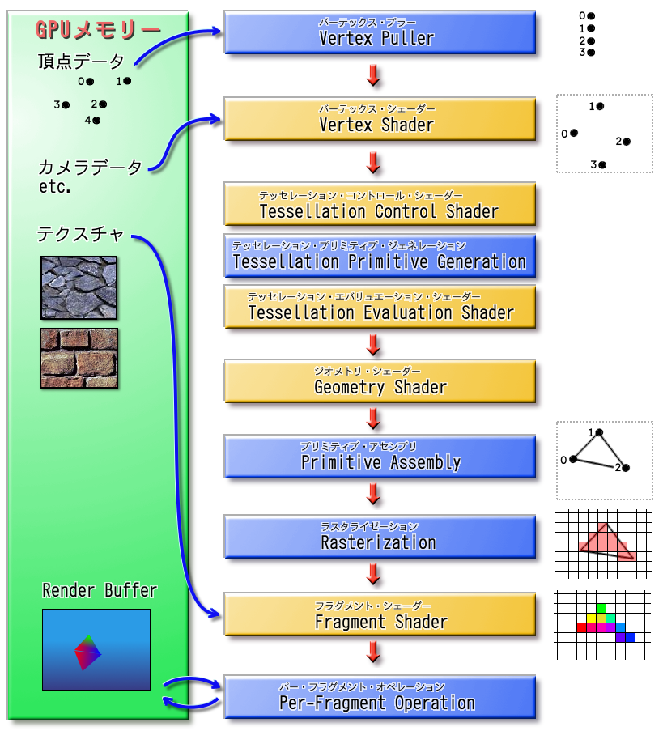

# OpenGLGame
-tn-mai講師に習ったことをout-putする場所-

[tn-mai講師:今年度のtext](https://github.com/tn-mai/OpenGL3D2023)

## 1.グラフィックス・パイプライン

## 1-1.VertexPuller
GPUメモリからひとつずつ頂点データ

(VertexShaderが実際に必要とする情報

(「頂点アトリビュート」で設定))を取り出し,

VertexShaderに渡す

## 1-2.VertexShader
VertexPullerから受け取った頂点データで

プリミティブの回転,拡大縮小,移動のほか,

座標系の変換,頂点単位のライティングなど,

様々な操作を行う

## 1-3.TessellationControlShader
新たに作成する小さなプリミティブの頂点データを,

どこに,どのように作成するかを指定する

## 1-4.TessellationPrimitiveGeneration
TessellationControlShaderからの情報で,

実際に小さなプリミティブへと分割し,

TessellationEvaluationShaderに渡す

## 1-5.TessellationEvaluationShader
TessellationPrimitiveGenerationからの情報で,

プリミティブの座標や色を変形し,

実際に複雑なディテールを加える

## 1-6.GeometryShader
ひとつのプリミティブの全頂点データを受け取り,

0個以上のプリミティブの頂点データを生成し,

PrimitiveAssemblyに渡す

## 1-7.PrimitiveAssembly
GeometryShaderで変換された

1つ以上の頂点データを蓄積し,

プリミティブを構成できる数になった段階で,

Rasterizationに渡す

## 1-8.Rasterization(RS)
PrimitiveAssemblyからのプリミティブをもとに,

フラグメントと呼ばれるピクセル片を生成し,

FragmentShaderに渡す

また,裏向きのプリミティブを除去(カリング)や,

プリミティブの画面に表示されない部分を

切り捨てる(クリッピング)

また,「ビューポート」で

「クリッピング空間」から,

「スクリーン空間」への変換を行う

## 1-9.FragmentShader
Rasterizationから送られてきた

フラグメントから,実際の色を計算する

## 1-10.Per-FragmentOperations
FragmentShaderから送られてきた

色情報と深度情報を,

「RenderBuffer」や「DepthBuffer」,

「StencilBuffer」と呼ばれる,

メモリ上の領域に書き込む

## 1-11.Render Buffer(描画した画像を格納するメモリ上の領域)
プリミティブを描画する

## 2.シェーダ