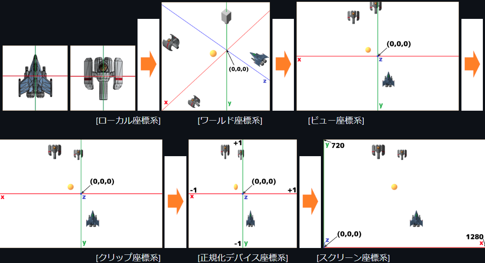

# OpenGLGame
-tn-mai講師に習ったことをout-putする場所-

[tn-mai講師:今年度のtext](https://github.com/tn-mai/OpenGL3D2023)

## 1.図形の大小の変更,位置の制御
### 1-1.図形の大小の変更
`standard.vert`
```diff
 // プログラムからの入力
 // uniform変数
 // ->シェーダプログラムに
 // C++プログラムから値を渡すための変数
+layout(location=0) uniform vec3 scale; // 拡大率
 
 void main()
 {
   outTexcoord = inTexcoord;
+  vec3 pos = inPosition * scale;
   gl_Position = 
 	vec4
 	(
 		pos,
 		1.0
 	);
 }
```

`Main.cpp`
```diff
     // 1番目の頂点属性の設定
     glVertexAttribPointer
     (
         1,                              // 頂点属性配列のインデックス
         2,                              // データの要素数
         GL_FLOAT,                       // データの型
         GL_FALSE,                       // 正規化の有無
         sizeof(Vertex),                 // 次のデータまでのバイト数
         reinterpret_cast<const void*>   // 最初のデータの位置
         (
             // 構造体の先頭から特定のメンバまでの
             // バイト数の計算
             offsetof
             (
                 Vertex,     // 構造体名
                 texcoord    // メンバ名
             )
         )
     );
 #pragma endregion
 
 #pragma region 物体のパラメータ
     class GameObject
     {
     public:
+        vec3 scale = { 1,1,1 };          // 物体の拡大率
         float color[4] = { 1, 1, 1, 1 }; // 物体の色
     };
     GameObject box0;
+    box0.scale = { 0.1f,0.1f,0.1f };
 #pragma endregion
 
 #pragma region テクスチャの作成
```
```diff
 // 変数ユニフォームにデータワット
 glProgramUniform4fv
 (
     prog3D,     // プログラムオブジェクトの管理番号
     100,        // 送り先ロケーション番号
     1,          // データ数
     box0.color  // データのアドレス
 );
+glProgramUniform3fv
+(
+    prog3D,         // プログラムオブジェクトの管理番号
+    0,              // 送り先ロケーション番号
+    1,              // データ数
+    &box0.scale.x   // データのアドレス
+);
 
 // 描画に使うテクスチャを
 // (テクスチャ・イメージ・ユニットに)割り当て
 glBindTextures
 (
```

## 課題01
内容

図形のX, Y, Z軸すべての大きさを

0.2にしなさい.

`Main.cpp`
```C++
     // 1番目の頂点属性の設定
     glVertexAttribPointer
     (
         1,                              // 頂点属性配列のインデックス
         2,                              // データの要素数
         GL_FLOAT,                       // データの型
         GL_FALSE,                       // 正規化の有無
         sizeof(Vertex),                 // 次のデータまでのバイト数
         reinterpret_cast<const void*>   // 最初のデータの位置
         (
             // 構造体の先頭から特定のメンバまでの
             // バイト数の計算
             offsetof
             (
                 Vertex,     // 構造体名
                 texcoord    // メンバ名
             )
         )
     );
 #pragma endregion
 
 #pragma region 物体のパラメータ
     class GameObject
     {
     public:
         vec3 scale = { 1,1,1 };         // 物体の拡大率
         float color[4] = { 1, 1, 1, 1 };// 物体の色
     };
     GameObject box0;
     box0.scale = { 0.2f,0.2f,0.2f };
 #pragma endregion
 
 #pragma region テクスチャの作成
```

### 1-2.図形の平行移動
`standard.vert`
```diff
 // シェーダからの出力
 layout(location=1) out vec2 outTexcoord;    // テクスチャ座標
 
 // プログラムからの入力
 // uniform変数
 // ->シェーダプログラムに
 // C++プログラムから値を渡すための変数
 layout(location=0) uniform vec3 scale; // 拡大率
+layout(location=1) uniform vec3 position; // 位置
 
 void main()
 {
   outTexcoord = inTexcoord;
+  vec3 pos = inPosition * scale + position;
   gl_Position = 
 	vec4
 	(
 		pos,
 		1.0
 	);
 }
```

`Main.cpp`
```diff
     // 1番目の頂点属性の設定
     glVertexAttribPointer
     (
         1,                              // 頂点属性配列のインデックス
         2,                              // データの要素数
         GL_FLOAT,                       // データの型
         GL_FALSE,                       // 正規化の有無
         sizeof(Vertex),                 // 次のデータまでのバイト数
         reinterpret_cast<const void*>   // 最初のデータの位置
         (
             // 構造体の先頭から特定のメンバまでの
             // バイト数の計算
             offsetof
             (
                 Vertex,     // 構造体名
                 texcoord    // メンバ名
             )
         )
     );
 #pragma endregion
 
 #pragma region 物体のパラメータ
     class GameObject
     {
     public:
+        vec3 position = { 0, 0, 0 };    // 物体の位置
         vec3 scale = { 1,1,1 };         // 物体の拡大率
         float color[4] = { 1, 1, 1, 1 };// 物体の色
     };
     GameObject box0;
     box0.scale = { 0.2f,0.2f,0.2f };
+    box0.position = { -0.6f,-0.6f,0 };
 #pragma endregion
 
 #pragma region テクスチャの作成
```
```diff
 glProgramUniform3fv
 (
     prog3D,         // プログラムオブジェクトの管理番号
     0,              // 送り先ロケーション番号
     1,              // データ数
     &box0.scale.x   // データのアドレス
 );
+glProgramUniform3fv
+(
+    prog3D,             // プログラムオブジェクトの管理番号
+    1,                  // 送り先ロケーション番号
+    1,                  // データ数
+    &box0.position.x    // データのアドレス
+);
 
 // 描画に使うテクスチャを
 // (テクスチャ・イメージ・ユニットに)割り当て
 glBindTextures
 (
```

## 課題02
内容

図形の座標を変更し,

画面の好きな位置に表示しなさい.
```C++
     // 1番目の頂点属性の設定
     glVertexAttribPointer
     (
         1,                              // 頂点属性配列のインデックス
         2,                              // データの要素数
         GL_FLOAT,                       // データの型
         GL_FALSE,                       // 正規化の有無
         sizeof(Vertex),                 // 次のデータまでのバイト数
         reinterpret_cast<const void*>   // 最初のデータの位置
         (
             // 構造体の先頭から特定のメンバまでの
             // バイト数の計算
             offsetof
             (
                 Vertex,     // 構造体名
                 texcoord    // メンバ名
             )
         )
     );
 #pragma endregion
 
 #pragma region 物体のパラメータ
     class GameObject
     {
     public:
         vec3 position = { 0, 0, 0 };    // 物体の位置
         vec3 scale = { 1,1,1 };         // 物体の拡大率
         float color[4] = { 1, 1, 1, 1 };// 物体の色
     };
     GameObject box0;
     box0.scale = { 0.2f,0.2f,0.2f };
     box0.position = { ?,?,0 };
 #pragma endregion
 
 #pragma region テクスチャの作成
```

### 1-3.図形の複数表示
`Main.cpp`
```diff
 #pragma region 物体のパラメータ
     class GameObject
     {
     public:
         vec3 position = { 0, 0, 0 };    // 物体の位置
         vec3 scale = { 1,1,1 };         // 物体の拡大率
         float color[4] = { 1, 1, 1, 1 };// 物体の色
     };
     GameObject box0;
     box0.scale = { 0.2f,0.2f,0.2f };
     box0.position = { 0.6f,0.6f,0 };
 
+    GameObject box1;
+    box1.color[1] = 0.5f; // 緑成分の明るさを半分にしてみる
+    box1.scale = { 0.2f, 0.2f, 0.2f };
+    box1.position = { 0, 0, 0 };
 #pragma endregion
 
 #pragma region テクスチャの作成
```
```diff
 // 図形の描画
 glDrawElementsInstanced
 (
     GL_TRIANGLES,       // 基本図形の種類
     6,                  // インデックスデータ数
     GL_UNSIGNED_SHORT,  // インデックスデータの型
     0,                  // インデックスデータの開始位置
     1                   // 描画する図形の数
 );
 
+// ふたつめの図形の描画
+glProgramUniform4fv
+(
+    prog3D,     // プログラムオブジェクトの管理番号
+    100,        // 送り先ロケーション番号
+    1,          // データ数
+    box1.color  // データのアドレス
+);
+glProgramUniform3fv
+(
+    prog3D,         // プログラムオブジェクトの管理番号
+    0,              // 送り先ロケーション番号
+    1,              // データ数
+    &box1.scale.x   // データのアドレス
+);
+glProgramUniform3fv
+(
+    prog3D,             // プログラムオブジェクトの管理番号
+    1,                  // 送り先ロケーション番号
+    1,                  // データ数
+    &box1.position.x    // データのアドレス
+);
+glDrawElementsInstanced
+(
+    GL_TRIANGLES,       // 基本図形の種類
+    6,                  // インデックスデータ数
+    GL_UNSIGNED_SHORT,  // インデックスデータの型
+    0,                  // インデックスデータの開始位置
+    1                   // 描画する図形の数
+);
 
 // VAOの割り当てを解除
 // 引数 : 割り当てる頂点属性配列の管理番号
 glBindVertexArray(0);
```

### 1-4.図形の回転
図形の回転は,高校数学IIの三角関数の

「点の回転」の式を使えば実現できます.

`XY平面上の回転`
```C++
点P(x, y)を原点まわりにθ度回転させた点Q(x', y')を求める式
x' = x * cosθ + y * -sinθ
y' = x * sinθ + y * cosθ
```

`回転軸はY軸,操作対象となる座標はXとZ`

`Z軸の向きが奥に向かってプラスの式`
```C++
x' = x * cosθ + z * -sinθ
z' = x * sinθ + z * cosθ
```

<p align="center">
<br>
</p>

`座標系の違いはZ軸の向きだけ`

`->X座標に加算するZ成分と,`

`  Z座標に加算するX成分の符号を反転`

`手前に向かってプラスの式(OpenGL対応)`
```C++
x' = x * cosθ + z * sinθ
z' = x * -sinθ + z * cosθ
```

`standard.vert`
```diff
 // シェーダからの出力
 layout(location=1) out vec2 outTexcoord;    // テクスチャ座標
 
 // プログラムからの入力
 // uniform変数
 // ->シェーダプログラムに
 // C++プログラムから値を渡すための変数
 layout(location=0) uniform vec3 scale;		// 拡大率
 layout(location=1) uniform vec3 position;	// 位置
+layout(location=2) uniform vec2 sinCosY;	// Y軸回転
 
 void main()
 {
+	outTexcoord = inTexcoord;
+	// スケール
+	vec3 pos = inPosition * scale;
+	
+	// Y軸回転
+	float sinY = sinCosY.x;
+	float cosY = sinCosY.y;
+	gl_Position.x = pos.x * cosY + pos.z * sinY;
+	gl_Position.y = pos.y;
+	gl_Position.z = pos.x * -sinY + pos.z * cosY;
+	
+	// 平行移動
+	gl_Position.xyz += position;
+	gl_Position.w = 1;
 }
```

gl_Position.xyzという書き方は,

GLSLの「スウィズリング(swizzling)」

`Main.cpp`
```diff
 #pragma region 物体のパラメータ
     class GameObject
     {
     public:
         vec3 position = { 0, 0, 0 };    // 物体の位置
+        vec3 rotation = { 0, 0, 0 };    // 物体の回転角度
         vec3 scale = { 1,1,1 };         // 物体の拡大率
         float color[4] = { 1, 1, 1, 1 };// 物体の色
     };
     GameObject box0;
     box0.scale = { 0.2f,0.2f,0.2f };
     box0.position = { 0.6f,0.6f,0 };
 
     GameObject box1;
     box1.color[1] = 0.5f; // 緑成分の明るさを半分にしてみる
     box1.scale = { 0.2f, 0.2f, 0.2f };
     box1.position = { 0, 0, 0 };
 #pragma endregion
 
 #pragma region テクスチャの作成
```
```diff
 #pragma region メインループの定義
 // ウィンドウの終了要求が来ていなかった(0)時,
 // メインループ処理を続ける
 // 引数 : GLFWwindowへのポインタ
 while (!glfwWindowShouldClose(window))
 {
+    // box0の回転
+    box0.rotation.y += 0.0001f;
 
     // バックバッファを消去するときに使用する色を指定
     glClearColor
     (
```
```diff
 glProgramUniform3fv
 (
     prog3D,             // プログラムオブジェクトの管理番号
     1,                  // 送り先ロケーション番号
     1,                  // データ数
     &box0.position.x    // データのアドレス
 );
+glProgramUniform2f
+(
+    prog3D,
+    2,
+    sin(box0.rotation.y),
+    cos(box0.rotation.y)
+);
 
 // 描画に使うテクスチャを
 // (テクスチャ・イメージ・ユニットに)割り当て
 glBindTextures
 (
```
```diff
 glProgramUniform3fv
 (
     prog3D,             // プログラムオブジェクトの管理番号
     1,                  // 送り先ロケーション番号
     1,                  // データ数
     &box1.position.x    // データのアドレス
 );
+glProgramUniform2f
+(
+    prog3D,
+    2,
+    sin(box1.rotation.y),
+    cos(box1.rotation.y)
+);
 glDrawElementsInstanced
 (
```

`C言語の三角関数`

×円周を0～360度で表す「度数法(どすうほう)」

〇0～2πで表す「弧度法(こどほう)」

`度数法から弧度法への変換`
```C++
弧度法の値 = 度数法の値 / 180 * π
```

### 1-5.遠近法の有効化
`Main.cpp`
```diff
 #pragma region 物体のパラメータ
     class GameObject
     {
     public:
         vec3 position = { 0, 0, 0 };    // 物体の位置
         vec3 rotation = { 0, 0, 0 };    // 物体の回転角度
         vec3 scale = { 1,1,1 };         // 物体の拡大率
         float color[4] = { 1, 1, 1, 1 };// 物体の色
     };
     GameObject box0;
     box0.scale = { 0.2f,0.2f,0.2f };
+    box0.position = { 0.6f,0.6f,-1 };
 
     GameObject box1;
     box1.color[1] = 0.5f; // 緑成分の明るさを半分にしてみる
     box1.scale = { 0.2f, 0.2f, 0.2f };
     box1.position = { 0, 0, 0 };
 #pragma endregion
 
 #pragma region テクスチャの作成
```
`standard.vert`
```diff
 	// 平行移動
 	gl_Position.xyz += position;
 
+	// 遠近法の有効化
+	gl_Position.zw = -gl_Position.zz;
 }
```

## 課題03
内容

box1が画面に表示されるように,

Z軸の値(Z座標)を変更しなさい.
```C++
 #pragma region 物体のパラメータ
     class GameObject
     {
     public:
         vec3 position = { 0, 0, 0 };    // 物体の位置
         vec3 rotation = { 0, 0, 0 };    // 物体の回転角度
         vec3 scale = { 1,1,1 };         // 物体の拡大率
         float color[4] = { 1, 1, 1, 1 };// 物体の色
     };
     GameObject box0;
     box0.scale = { 0.2f,0.2f,0.2f };
+    box0.position = { 0.6f,0.6f,-1 };
 
     GameObject box1;
     box1.color[1] = 0.5f; // 緑成分の明るさを半分にしてみる
     box1.scale = { 0.2f, 0.2f, 0.2f };
     box1.position = { 0, 0, ? };
 #pragma endregion
 
 #pragma region テクスチャの作成
```

### 1-7.アスペクト比の手直し
>1. GPU : NDC座標系(-1~+1の範囲の座標)
>2. CPU : ワールド座標系<br>
(標準的な座標を扱う空間)<br>
※「図形の拡大縮小・回転・平行移動」の操作ができる
>3. ワールド座標系->NDC座標系に変換が必要
>4. 遠近法が有効な場合,クリップ座標系の変換を間に挟む

`standard.vert`
```diff
 // シェーダからの出力
 layout(location=1) out vec2 outTexcoord;    // テクスチャ座標
 
 // プログラムからの入力
 // uniform変数
 // ->シェーダプログラムに
 // C++プログラムから値を渡すための変数
 layout(location=0) uniform vec3 scale;			// 拡大率
 layout(location=1) uniform vec3 position;		// 位置
 layout(location=2) uniform vec2 sinCosY;		// Y軸回転
+layout(location=3) uniform float aspectRatio;	// アスペクト比
 
 void main()
 {
```
```diff
 // 平行移動
 gl_Position.xyz += position;
 
+// ワールド座標系からクリップ座標系に変換
+gl_Position.x /= aspectRatio;
 
 // 遠近法の有効化
 gl_Position.zw = -gl_Position.zz;
```

`Main.cpp`
```diff
 // 描画に使うシェーダの指定
 glUseProgram(prog3D);

+// フレームバッファの大きさを取得
+int fbWidth, fbHeight;
+glfwGetFramebufferSize
+(
+    window,     // GLFWウィンドウオブジェクトのアドレス
+    &fbWidth,   // 描画ウィンドウの幅を格納する変数のアドレス
+    &fbHeight   // 描画ウィンドウの高さを格納する変数のアドレス
+);
+
+// アスペクト比の設定
+const float aspectRatio =
+  static_cast<float>(fbWidth) / static_cast<float>(fbHeight);
+glProgramUniform1f
+(
+    prog3D,     // プログラムオブジェクトの管理番号
+    3,          // 送り先ロケーション番号
+    aspectRatio // データのアドレス
+);

 // 変数ユニフォームにデータワット
 glProgramUniform4fv
 (
```

### 1-8.ビューポートの手直し
```diff
 // フレームバッファの大きさを取得
 int fbWidth, fbHeight;
 glfwGetFramebufferSize
 (
     window,     // GLFWウィンドウオブジェクトのアドレス
     &fbWidth,   // 描画ウィンドウの幅を格納する変数のアドレス
     &fbHeight   // 描画ウィンドウの高さを格納する変数のアドレス
 );

+// ビューポートの設定
+glViewport
+(
+    0,          // 描画範囲の左下Xの座標
+    0,          // 描画範囲の左下のY座標
+    fbWidth,    // 描画範囲の幅
+    fbHeight    // 描画範囲の高さ
+);
 
 // アスペクト比の設定
 const float aspectRatio =
   static_cast<float>(fbWidth) / static_cast<float>(fbHeight);
 glProgramUniform1f
 (
```

## 2.座標系
<p align="center">
<br>
</p>

* ローカル座標系(モデル座標系,オブジェクト座標系)

    3Dモデルを定義する座標系.

    頂点シェーダーの入力はこの座標系

    原点は,3Dモデルの中心か足元とされること 多

    2Dゲームの場合,回転,拡大縮小を行ったり,

    ゲームオブジェクトに複数の画像を

    貼り付けたりするときに使う.

* ワールド座標系

    3Dモデル同士の位置関係を定義する座標系.

    原点は,シーンの中心とされること 多

    ローカル座標系からワールド座標系への変換は

    「モデル変換」または「ワールド変換」と呼ばれる

* ビュー座標系(カメラ座標系,視点座標系)

    視点を基準とする座標系

    原点は,視点の座標

    ワールド座標系からビュー座標系への変換は

    「ビュー変換」と呼ばれる

    2Dゲームではこの座標系はカメラの位置と向きが

    固定されているため飛ばされる

* クリップ座標系

    画面に映らない部分を除去する(クリッピング)

    処理のための座標系

    頂点シェーダーから出力される座標は,

    この座標系で定義されていなければならない

    ビュー座標系からクリップ座標系への変換は

    「プロジェクション変換」と呼ばれる

* 正規化デバイス(NDC)座標系

    クリップ座標系のX,Y,Z要素をW要素で

    除算した座標系

    頂点座標を正規化デバイス座標系に変換したとき,
 
    XYZのいずれかの要素が1より大きいか,
 
    または-1より小さい場合は描画がスキップされる

    (画面外の頂点を描画するのは無駄だから)

    クリップ座標系から正規化デバイス座標系への
 
    変換はGPUが自動的に行う

    2Dゲームの場合,特に意識することはなし

* スクリーン座標系(ウィンドウ座標系)

    フレームバッファ上の座標系

    スクリーン座標系は2Dの座標系

    3Dの正規化デバイス座標系から
 
    2Dスクリーン座標系への変換は
 
    GPUが自動的に行う

## 3.カメラ
### 3-1.カメラオブジェクトの作成
`standard.vert`
```diff
 // プログラムからの入力
 // uniform変数
 // ->シェーダプログラムに
 // C++プログラムから値を渡すための変数
 layout(location=0) uniform vec3 scale;			// 拡大率
 layout(location=1) uniform vec3 position;		// 位置
 layout(location=2) uniform vec2 sinCosY;		// Y軸回転
 layout(location=3) uniform float aspectRatio;	// アスペクト比
+layout(location=4) uniform vec3 cameraPosition; // カメラの位置
+layout(location=5) uniform vec2 cameraSinCosY;  // カメラのY軸回転
 
 void main()
 {
 	outTexcoord = inTexcoord;
 
+	// ローカル座標系からワールド座標系に変換
 	// スケール
 	vec3 pos = inPosition * scale;
 	
 	// Y軸回転
 	float sinY = sinCosY.x;
 	float cosY = sinCosY.y;
 	gl_Position.x = pos.x * cosY + pos.z * sinY;
 	gl_Position.y = pos.y;
 	gl_Position.z = pos.x * -sinY + pos.z * cosY;
 	
 	// 平行移動
 	gl_Position.xyz += position;
 
+	// ワールド座標系からビュー座標系に変換
+   pos = gl_Position.xyz - cameraPosition;
+   float cameraSinY = cameraSinCosY.x;
+   float cameraCosY = cameraSinCosY.y;
+   gl_Position.x = pos.x * cameraCosY + pos.z * cameraSinY;
+   gl_Position.y = pos.y;
+   gl_Position.z = pos.x * -cameraSinY + pos.z * cameraCosY;
+   
+   // ビュー座標系からクリップ座標系に変換
 	gl_Position.x /= aspectRatio;
 
 	// 遠近法の有効化
 	gl_Position.zw = -gl_Position.zz;
 }
```

`Main.cpp`
```diff
 #pragma region 物体のパラメータ
     class GameObject
     {
     public:
         vec3 position = { 0, 0, 0 };    // 物体の位置
         vec3 rotation = { 0, 0, 0 };    // 物体の回転角度
         vec3 scale = { 1,1,1 };         // 物体の拡大率
         float color[4] = { 1, 1, 1, 1 };// 物体の色
     };
 
+    // カメラオブジェクト
+    GameObject camera;
 
     GameObject box0;
     box0.scale = { 0.2f,0.2f,0.2f };
     box0.position = { 0.6f,0.6f,-1 };
 
     GameObject box1;
     box1.color[1] = 0.5f; // 緑成分の明るさを半分にしてみる
     box1.scale = { 0.2f, 0.2f, 0.2f };
     box1.position = { 0, 0, -1 };
 #pragma endregion
 
 #pragma region テクスチャの作成
```
```diff
 // box0の回転
 box0.rotation.y += 0.0001f;
 
+// glfwGetKey(GLFWウィンドウオブジェクトのアドレス,キー番号);
+// GLFW_RELEASE : キー入力なし
+// GLFW_PRESS   : キー入力あり
+// カメラのX軸移動
+if (glfwGetKey(window, GLFW_KEY_A) == GLFW_PRESS) {
+  camera.position.x -= 0.0005f;
+}
+if (glfwGetKey(window, GLFW_KEY_D) == GLFW_PRESS) {
+  camera.position.x += 0.0005f;
+}
+
+// カメラのY軸回転
+if (glfwGetKey(window, GLFW_KEY_RIGHT) == GLFW_PRESS) {
+  camera.rotation.y -= 0.0005f;
+}
+if (glfwGetKey(window, GLFW_KEY_LEFT) == GLFW_PRESS) {
+  camera.rotation.y += 0.0005f;
+}
 
 // バックバッファを消去するときに使用する色を指定
 glClearColor
 (
```
```diff
 glProgramUniform1f
 (
     prog3D,     // プログラムオブジェクトの管理番号
     3,          // 送り先ロケーション番号
     aspectRatio // データのアドレス
 );
 
+// カメラパラメータの設定
+glProgramUniform3fv
+(
+    prog3D,             // プログラムオブジェクトの管理番号
+    4,                  // 送り先ロケーション番号
+    1,                  // データ数
+    &camera.position.x  // データのアドレス
+);
+glProgramUniform2f
+(
+    prog3D,                     // プログラムオブジェクトの管理番号
+    5,                          // 送り先ロケーション番号
+    sin(-camera.rotation.y),    // データ数
+    cos(-camera.rotation.y)     // データのアドレス
+);
 
 // 変数ユニフォームにデータワット
 glProgramUniform4fv
 (
```

## 課題04
内容

カメラのX軸移動の下に,

カメラのZ軸移動を行うプログラムを

追加しなさい.

キーで前方( W-Z方向),

Sキーで後方(+Z方向)に移動させること.

`Main.cpp`
```C++
// glfwGetKey(GLFWウィンドウオブジェクトのアドレス,キー番号);
// GLFW_RELEASE : キー入力なし
// GLFW_PRESS   : キー入力あり
// カメラのX軸移動
if (glfwGetKey(window, GLFW_KEY_A) == GLFW_PRESS)
{
  camera.position.x -= 0.001f;
}
if (glfwGetKey(window, GLFW_KEY_D) == GLFW_PRESS)
{
  camera.position.x += 0.001f;
}
if (glfwGetKey(window, GLFW_KEY_W) == GLFW_PRESS)
{
  camera.position.z -= 0.001f;
}
if (glfwGetKey(window, GLFW_KEY_S) == GLFW_PRESS)
{
  camera.position.z += 0.001f;
}

// カメラのY軸回転
if (glfwGetKey(window, GLFW_KEY_RIGHT) == GLFW_PRESS)
{
  camera.rotation.y -= 0.0005f;
}
if (glfwGetKey(window, GLFW_KEY_LEFT) == GLFW_PRESS)
{
  camera.rotation.y += 0.0005f;
}
```

### 3-2.立方体の定義
`Main.cpp`
```diff
 struct Vertex
 {
     vec3 position; // 頂点座標
     vec2 texcoord; // テクスチャ座標
 };
 const Vertex vertexData[] =
 {
+    // +Z(手前の面)
+    { {-1,-1, 1 }, { 0, 0 } },
+    { { 1,-1, 1 }, { 1, 0 } },
+    { { 1, 1, 1 }, { 1, 1 } },
+    { {-1, 1, 1 }, { 0, 1 } },
+
+    // -Z(奥の面)
+    { { 1,-1,-1 }, { 0, 0 } },
+    { {-1,-1,-1 }, { 1, 0 } },
+    { {-1, 1,-1 }, { 1, 1 } },
+    { { 1, 1,-1 }, { 0, 1 } },
 };
 GLuint vbo = 0; // 頂点バッファの管理番号
```
```diff
 #pragma region インデックスデータをGPUメモリにコピー
     // インデックスデータ(図形を構成する頂点番号)
     const GLushort indexData[] =
     {
         0, 1, 2, 2, 3, 0,
+        4, 5, 6, 6, 7, 4,
     };
     GLuint ibo = 0; // インデックスバッファの管理番号
```
```diff
 glBindTextures
 (
     0,      // 割り当て開始インデックス
     1,      // 割り当てる個数
     &tex    // テクスチャ管理番号配列のアドレス
 );

 // 図形の描画
+const GLsizei indexCount = std::size(indexData);    // インデックス数
 glDrawElementsInstanced
 (
     GL_TRIANGLES,       // 基本図形の種類
+    indexCount,         // インデックスデータ数
     GL_UNSIGNED_SHORT,  // インデックスデータの型
     0,                  // インデックスデータの開始位置
     1                   // 描画する図形の数
 );

 // ふたつめの図形の描画
 glProgramUniform4fv
 (
```
```diff
 glProgramUniform2f
 (
     prog3D,
     2,
     sin(box1.rotation.y),
     cos(box1.rotation.y)
 );
 glDrawElementsInstanced
 (
     GL_TRIANGLES,       // 基本図形の種類
+    indexCount,         // インデックスデータ数
     GL_UNSIGNED_SHORT,  // インデックスデータの型
     0,                  // インデックスデータの開始位置
     1                   // 描画する図形の数
 );
 
 // VAOの割り当ての解除
 // 引数 : 割り当てる頂点属性配列の管理番号
 glBindVertexArray(0);
```

### 3-3.深度テストの有効化
`Main.cpp`
```diff
 glProgramUniform2f
 (
     prog3D,                     // プログラムオブジェクトの管理番号
     5,                          // 送り先ロケーション番号
     sin(-camera.rotation.y),    // データ数
     cos(-camera.rotation.y)     // データのアドレス
 );
 
+// 深度テストの有効化
+// glEnable : 指定されたOpenGLコンテキストの有効化
+// 引数 : 有効にする機能を表すマクロ定数
+// GL_DEPTH_TEST : 深度テスト
+glEnable(GL_DEPTH_TEST);
 
 // 変数ユニフォームにデータワット
 glProgramUniform4fv
 (
```

深度テストは「深度バッファの値と,

描画するピクセルの深度値を比較する」

ことで行われる.

そこで,計算結果が深度値によって

異なるように...

`深度値の補正`
>1. 「奥行き(Z軸)方向の描画範囲」を決める.<br>
  手前側の境界をnear(ニア),奥側の境界をfar(ファー)とする.
>2. 計算結果について,深度値がnearと等しい場合に-1,<br>
  farと等しい場合に1となるような計算式を求める.

`standard.vert`
```diff
     // ビュー座標系からクリップ座標系に変換
 	gl_Position.x /= aspectRatio;
 
+	// 深度値の計算結果が-1～+1になるようなパラメータA, Bを計算
+	const float near = 0.5;
+	const float far = 1000;
+	const float A = -2 * far * near / (far - near);
+	const float B = (far + near) / (far - near);
+
+	// 遠近法の有効化
+	gl_Position.w = -gl_Position.z;
+	gl_Position.z = -gl_Position.z * B + A; // 深度値の補正
 }
```

### 3-4.立方体の完成
`Main.cpp`
```diff
     // -Z(奥の面)
     { { 1,-1,-1 }, { 0, 0 } },
     { {-1,-1,-1 }, { 1, 0 } },
     { {-1, 1,-1 }, { 1, 1 } },
     { { 1, 1,-1 }, { 0, 1 } },
 
+    // +Y(上の面)
+    { { 1, 1, 1 }, { 0, 0 } },
+    { { 1, 1,-1 }, { 1, 0 } },
+    { {-1, 1,-1 }, { 1, 1 } },
+    { {-1, 1, 1 }, { 0, 1 } },
+    
+    // -Y(下の面)
+    { { 1,-1,-1 }, { 0, 0 } },
+    { { 1,-1, 1 }, { 1, 0 } },
+    { {-1,-1, 1 }, { 1, 1 } },
+    { {-1,-1,-1 }, { 0, 1 } },
 };
 GLuint vbo = 0; // 頂点バッファの管理番号
```

## 課題05
内容

vertexDataとindexDataに

「+Xおよび-Xの面を表すデータ」を

追加し,箱を完成させなさい.
`Main.cpp`
```C++
        // -Y(下の面)
        { { 1,-1,-1 }, { 0, 0 } },
        { { 1,-1, 1 }, { 1, 0 } },
        { {-1,-1, 1 }, { 1, 1 } },
        { {-1,-1,-1 }, { 0, 1 } },
        
        // +X(右の面)
        { { 1, 1, 1 }, { 0, 0 } },
        { { 1, 1,-1 }, { 1, 0 } },
        { { 1,-1,-1 }, { 1, 1 } },
        { { 1,-1, 1 }, { 0, 1 } },
        
        // -X(左の面)
        { {-1, 1, 1 }, { 0, 0 } },
        { {-1, 1,-1 }, { 1, 0 } },
        { {-1,-1,-1 }, { 1, 1 } },
        { {-1,-1, 1 }, { 0, 1 } },
    };
    GLuint vbo = 0; // 頂点バッファの管理番号
    // バッファオブジェクト(GPUメモリを管理するためのオブジェクト)の作成
    glCreateBuffers
    (
        1,      // 作成するオブジェクト数
        &vbo    // 頂点バッファの管理番号を格納する配列
    );
    // GPUメモリを確保のち,データをコピー
    // データのアドレスがnullptrなら,
    // GPUメモリの確保のみ
    glNamedBufferStorage
    (
        vbo,                // 頂点バッファの管理番号
        sizeof(vertexData), // コピーするバイト数
        vertexData,         // コピーするデータのアドレス
        0                   // 各種フラグ
    );
#pragma endregion

#pragma region インデックスデータをGPUメモリにコピー
    // インデックスデータ(図形を構成する頂点番号)
    const GLushort indexData[] =
    {
        0, 1, 2, 2, 3, 0,
        4, 5, 6, 6, 7, 4,
        8, 9,10,10,11, 8,
        12,13,14,14,15,12,
        16, 17,18,18,19, 16,
        20,21,22,22,23,20,
    };
    GLuint ibo = 0; // インデックスバッファの管理番号
```

### 3-5.視野角の設定
`standard.vert`
```diff
 // プログラムからの入力
 // uniform変数
 // ->シェーダプログラムに
 // C++プログラムから値を渡すための変数
 layout(location=0) uniform vec3 scale;			// 拡大率
 layout(location=1) uniform vec3 position;		// 位置
 layout(location=2) uniform vec2 sinCosY;		// Y軸回転
 
+// アスペクト比と視野角による拡大率
+layout(location=3) uniform vec2 aspectRatioAndScaleFov;
 
 layout(location=4) uniform vec3 cameraPosition; // カメラの位置
 layout(location=5) uniform vec2 cameraSinCosY;  // カメラのY軸回転
 
 void main()
 {
```
```diff
 // ビュー座標系からクリップ座標系に変換
+const float aspectRatio = aspectRatioAndScaleFov.x;
 gl_Position.x /= aspectRatio;
 
+// 視野角を反映
+const float scaleFov = aspectRatioAndScaleFov.y;
+gl_Position.xy /= scaleFov;
 
 // 深度値の計算結果が-1～+1になるようなパラメータA, Bを計算
```

`Main.cpp`
```diff
 // ビューポートの設定
 glViewport
 (
     0,          // 描画範囲の左下Xの座標
     0,          // 描画範囲の左下のY座標
     fbWidth,    // 描画範囲の幅
     fbHeight    // 描画範囲の高さ
 );
 
+// アスペクト比と視野角の設定
+const float aspectRatio =
+  static_cast<float>(fbWidth) / static_cast<float>(fbHeight);
+const float degFovY = 60; // 垂直視野角
+const float radFovY = degFovY * 3.1415926535f / 180;
+const float scaleFov = tan(radFovY / 2); // 視野角による拡大率
+glProgramUniform2f
+(
+    prog3D,     // プログラムオブジェクトの管理番号
+    3,          // 送り先ロケーション番号
+    aspectRatio,// データ数
+    scaleFov    // データのアドレス
+);
 
 // カメラパラメータの設定
 glProgramUniform3fv
 (
```

### 3-6.除算をシェーダー->CPU側に
`Main.cpp`
```diff
 const float scaleFov = tan(radFovY / 2); // 視野角による拡大率
 glProgramUniform2f
 (
     prog3D,                         // プログラムオブジェクトの管理番号
     3,                              // 送り先ロケーション番号
+    1 / (aspectRatio * scaleFov),   // データ数
+    1 / scaleFov                    // データのアドレス
 );
 
 // カメラパラメータの設定
 glProgramUniform3fv
 (
```

`standard.vert`
```diff
 gl_Position.z = pos.x * -cameraSinY + pos.z * cameraCosY;
 
 // ビュー座標系からクリップ座標系に変換
+gl_Position.xy *= aspectRatioAndScaleFov;
 
 // 深度値の計算結果が-1～+1になるようなパラメータA, Bを計算
 const float near = 0.5;
```

### 3-7.カメラの向き = 移動する方向
`Main.cpp`
```diff
 // box0の回転
 box0.rotation.y += 0.0001f;
 
 // glfwGetKey(GLFWウィンドウオブジェクトのアドレス,キー番号);
 // GLFW_RELEASE : キー入力なし
 // GLFW_PRESS   : キー入力あり
+// カメラの移動
+const float cameraSpeed = 0.0005f;
+const float cameraCos = cos(camera.rotation.y);
+const float cameraSin = sin(camera.rotation.y);
+if (glfwGetKey(window, GLFW_KEY_A) == GLFW_PRESS)
+{
+    camera.position.x -= cameraSpeed * cameraCos;
+    camera.position.z -= cameraSpeed * -cameraSin;
+}
+if (glfwGetKey(window, GLFW_KEY_D) == GLFW_PRESS)
+{
+    camera.position.x += cameraSpeed * cameraCos;
+    camera.position.z += cameraSpeed * -cameraSin;
+}
+if (glfwGetKey(window, GLFW_KEY_W) == GLFW_PRESS)
+{
+    camera.position.x -= cameraSpeed * cameraSin;
+    camera.position.z -= cameraSpeed * cameraCos;
+}
+if (glfwGetKey(window, GLFW_KEY_S) == GLFW_PRESS)
+{
+    camera.position.x += cameraSpeed * cameraSin;
+    camera.position.z += cameraSpeed * cameraCos;
+}
 
 // カメラのY軸回転
 if (glfwGetKey(window, GLFW_KEY_RIGHT) == GLFW_PRESS)
 {
   camera.rotation.y -= 0.0005f;
 }
 if (glfwGetKey(window, GLFW_KEY_LEFT) == GLFW_PRESS)
 {
   camera.rotation.y += 0.0005f;
 }
```