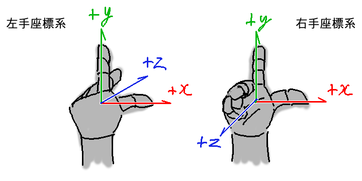

# OpenGLGame
-tn-mai講師に習ったことをout-putする場所-

[tn-mai講師:今年度のtext](https://github.com/tn-mai/OpenGL3D2023)

## 1.図形の大小の変更,位置の制御
### 1-1.図形の大小の変更
`standard.vert`
```diff
 // プログラムからの入力
 // uniform変数
 // ->シェーダプログラムに
 // C++プログラムから値を渡すための変数
+layout(location=0) uniform vec3 scale; // 拡大率
 
 void main()
 {
   outTexcoord = inTexcoord;
+  vec3 pos = inPosition * scale;
   gl_Position = 
 	vec4
 	(
 		pos,
 		1.0
 	);
 }
```
`Main.cpp`
```diff
     // 1番目の頂点属性を設定
     glVertexAttribPointer
     (
         1,                              // 頂点属性配列のインデックス
         2,                              // データの要素数
         GL_FLOAT,                       // データの型
         GL_FALSE,                       // 正規化の有無
         sizeof(Vertex),                 // 次のデータまでのバイト数
         reinterpret_cast<const void*>   // 最初のデータの位置
         (
             // 構造体の先頭から特定のメンバまでの
             // バイト数の計算
             offsetof
             (
                 Vertex,     // 構造体名
                 texcoord    // メンバ名
             )
         )
     );
 #pragma endregion
 
 #pragma region 物体のパラメータ
     class GameObject
     {
     public:
+        vec3 scale = { 1,1,1 };          // 物体の拡大率
         float color[4] = { 1, 1, 1, 1 }; // 物体の色
     };
     GameObject box0;
+    box0.scale = { 0.1f,0.1f,0.1f };
 #pragma endregion
 
 #pragma region テクスチャの作成
```
```diff
 // 変数ユニフォームにデータワット
 glProgramUniform4fv
 (
     prog3D,     // プログラムオブジェクトの管理番号
     100,        // 送り先ロケーション番号
     1,          // データ数
     box0.color  // データのアドレス
 );
+glProgramUniform3fv
+(
+    prog3D,         // プログラムオブジェクトの管理番号
+    0,              // 送り先ロケーション番号
+    1,              // データ数
+    &box0.scale.x   // データのアドレス
+);
 
 // 描画に使うテクスチャを
 // (テクスチャ・イメージ・ユニットに)割り当て
 glBindTextures
 (
```

## 課題01
内容

図形のX, Y, Z軸すべての大きさを

0.2にしなさい.
`Main.cpp`
```C++
     // 1番目の頂点属性を設定
     glVertexAttribPointer
     (
         1,                              // 頂点属性配列のインデックス
         2,                              // データの要素数
         GL_FLOAT,                       // データの型
         GL_FALSE,                       // 正規化の有無
         sizeof(Vertex),                 // 次のデータまでのバイト数
         reinterpret_cast<const void*>   // 最初のデータの位置
         (
             // 構造体の先頭から特定のメンバまでの
             // バイト数の計算
             offsetof
             (
                 Vertex,     // 構造体名
                 texcoord    // メンバ名
             )
         )
     );
 #pragma endregion
 
 #pragma region 物体のパラメータ
     class GameObject
     {
     public:
         vec3 scale = { 1,1,1 };         // 物体の拡大率
         float color[4] = { 1, 1, 1, 1 };// 物体の色
     };
     GameObject box0;
     box0.scale = { 0.2f,0.2f,0.2f };
 #pragma endregion
 
 #pragma region テクスチャの作成
```

### 1-2.図形の平行移動
`standard.vert`
```diff
 // シェーダからの出力
 layout(location=1) out vec2 outTexcoord;    // テクスチャ座標
 
 // プログラムからの入力
 // uniform変数
 // ->シェーダプログラムに
 // C++プログラムから値を渡すための変数
 layout(location=0) uniform vec3 scale; // 拡大率
+layout(location=1) uniform vec3 position; // 位置
 
 void main()
 {
   outTexcoord = inTexcoord;
+  vec3 pos = inPosition * scale + position;
   gl_Position = 
 	vec4
 	(
 		pos,
 		1.0
 	);
 }
```
`Main.cpp`
```diff
     // 1番目の頂点属性を設定
     glVertexAttribPointer
     (
         1,                              // 頂点属性配列のインデックス
         2,                              // データの要素数
         GL_FLOAT,                       // データの型
         GL_FALSE,                       // 正規化の有無
         sizeof(Vertex),                 // 次のデータまでのバイト数
         reinterpret_cast<const void*>   // 最初のデータの位置
         (
             // 構造体の先頭から特定のメンバまでの
             // バイト数の計算
             offsetof
             (
                 Vertex,     // 構造体名
                 texcoord    // メンバ名
             )
         )
     );
 #pragma endregion
 
 #pragma region 物体のパラメータ
     class GameObject
     {
     public:
+        vec3 position = { 0, 0, 0 };    // 物体の位置
         vec3 scale = { 1,1,1 };         // 物体の拡大率
         float color[4] = { 1, 1, 1, 1 };// 物体の色
     };
     GameObject box0;
     box0.scale = { 0.2f,0.2f,0.2f };
+    box0.position = { -0.6f,-0.6f,0 };
 #pragma endregion
 
 #pragma region テクスチャの作成
```
```diff
 glProgramUniform3fv
 (
     prog3D,         // プログラムオブジェクトの管理番号
     0,              // 送り先ロケーション番号
     1,              // データ数
     &box0.scale.x   // データのアドレス
 );
+glProgramUniform3fv
+(
+    prog3D,             // プログラムオブジェクトの管理番号
+    1,                  // 送り先ロケーション番号
+    1,                  // データ数
+    &box0.position.x    // データのアドレス
+);
 
 // 描画に使うテクスチャを
 // (テクスチャ・イメージ・ユニットに)割り当て
 glBindTextures
 (
```

## 課題02
内容

図形の座標を変更し,

画面の好きな位置に表示しなさい.
```C++
     // 1番目の頂点属性を設定
     glVertexAttribPointer
     (
         1,                              // 頂点属性配列のインデックス
         2,                              // データの要素数
         GL_FLOAT,                       // データの型
         GL_FALSE,                       // 正規化の有無
         sizeof(Vertex),                 // 次のデータまでのバイト数
         reinterpret_cast<const void*>   // 最初のデータの位置
         (
             // 構造体の先頭から特定のメンバまでの
             // バイト数の計算
             offsetof
             (
                 Vertex,     // 構造体名
                 texcoord    // メンバ名
             )
         )
     );
 #pragma endregion
 
 #pragma region 物体のパラメータ
     class GameObject
     {
     public:
         vec3 position = { 0, 0, 0 };    // 物体の位置
         vec3 scale = { 1,1,1 };         // 物体の拡大率
         float color[4] = { 1, 1, 1, 1 };// 物体の色
     };
     GameObject box0;
     box0.scale = { 0.2f,0.2f,0.2f };
     box0.position = { ?,?,0 };
 #pragma endregion
 
 #pragma region テクスチャの作成
```

### 1-3.図形の複数表示
`Main.cpp`
```diff
 #pragma region 物体のパラメータ
     class GameObject
     {
     public:
         vec3 position = { 0, 0, 0 };    // 物体の位置
         vec3 scale = { 1,1,1 };         // 物体の拡大率
         float color[4] = { 1, 1, 1, 1 };// 物体の色
     };
     GameObject box0;
     box0.scale = { 0.2f,0.2f,0.2f };
     box0.position = { 0.6f,0.6f,0 };
 
+    GameObject box1;
+    box1.color[1] = 0.5f; // 緑成分の明るさを半分にしてみる
+    box1.scale = { 0.2f, 0.2f, 0.2f };
+    box1.position = { 0, 0, 0 };
 #pragma endregion
 
 #pragma region テクスチャの作成
```
```diff
 // 図形を描画
 glDrawElementsInstanced
 (
     GL_TRIANGLES,       // 基本図形の種類
     6,                  // インデックスデータ数
     GL_UNSIGNED_SHORT,  // インデックスデータの型
     0,                  // インデックスデータの開始位置
     1                   // 描画する図形の数
 );
 
+// ふたつめの図形を描画
+glProgramUniform4fv
+(
+    prog3D,     // プログラムオブジェクトの管理番号
+    100,        // 送り先ロケーション番号
+    1,          // データ数
+    box1.color  // データのアドレス
+);
+glProgramUniform3fv
+(
+    prog3D,         // プログラムオブジェクトの管理番号
+    0,              // 送り先ロケーション番号
+    1,              // データ数
+    &box1.scale.x   // データのアドレス
+);
+glProgramUniform3fv
+(
+    prog3D,             // プログラムオブジェクトの管理番号
+    1,                  // 送り先ロケーション番号
+    1,                  // データ数
+    &box1.position.x    // データのアドレス
+);
+glDrawElementsInstanced
+(
+    GL_TRIANGLES,       // 基本図形の種類
+    6,                  // インデックスデータ数
+    GL_UNSIGNED_SHORT,  // インデックスデータの型
+    0,                  // インデックスデータの開始位置
+    1                   // 描画する図形の数
+);
 
 // VAOの割り当てを解除
 // 引数 : 割り当てる頂点属性配列の管理番号
 glBindVertexArray(0);
```

### 1-4.図形の回転
図形の回転は,高校数学IIの三角関数の

「点の回転」の式を使えば実現できます.
`XY平面上の回転`
```C++
点P(x, y)を原点まわりにθ度回転させた点Q(x', y')を求める式
x' = x * cosθ + y * -sinθ
y' = x * sinθ + y * cosθ
```

`回転軸はY軸,操作対象となる座標はXとZ`
`Z軸の向きが奥に向かってプラスの式`
```C++
x' = x * cosθ + z * -sinθ
z' = x * sinθ + z * cosθ
```

<p align="center">
<br>
</p>

`座標系の違いはZ軸の向きだけ`
`->X座標に加算するZ成分と,`
`  Z座標に加算するX成分の符号を反転`
`手前に向かってプラスの式(OpenGL対応)`
```C++
x' = x * cosθ + z * sinθ
z' = x * -sinθ + z * cosθ
```

`standard.vert`
```diff
 // シェーダからの出力
 layout(location=1) out vec2 outTexcoord;    // テクスチャ座標
 
 // プログラムからの入力
 // uniform変数
 // ->シェーダプログラムに
 // C++プログラムから値を渡すための変数
 layout(location=0) uniform vec3 scale;		// 拡大率
 layout(location=1) uniform vec3 position;	// 位置
+layout(location=2) uniform vec2 sinCosY;	// Y軸回転
 
 void main()
 {
+	outTexcoord = inTexcoord;
+	// スケール
+	vec3 pos = inPosition * scale;
+	
+	// Y軸回転
+	float sinY = sinCosY.x;
+	float cosY = sinCosY.y;
+	gl_Position.x = pos.x * cosY + pos.z * sinY;
+	gl_Position.y = pos.y;
+	gl_Position.z = pos.x * -sinY + pos.z * cosY;
+	
+	// 平行移動
+	gl_Position.xyz += position;
+	gl_Position.w = 1;
 }
```

gl_Position.xyzという書き方は,

GLSLの「スウィズリング(swizzling)」

`Main.cpp`
```diff
 #pragma region 物体のパラメータ
     class GameObject
     {
     public:
         vec3 position = { 0, 0, 0 };    // 物体の位置
+        vec3 rotation = { 0, 0, 0 };    // 物体の回転角度
         vec3 scale = { 1,1,1 };         // 物体の拡大率
         float color[4] = { 1, 1, 1, 1 };// 物体の色
     };
     GameObject box0;
     box0.scale = { 0.2f,0.2f,0.2f };
     box0.position = { 0.6f,0.6f,0 };
 
     GameObject box1;
     box1.color[1] = 0.5f; // 緑成分の明るさを半分にしてみる
     box1.scale = { 0.2f, 0.2f, 0.2f };
     box1.position = { 0, 0, 0 };
 #pragma endregion
 
 #pragma region テクスチャの作成
```
```diff
 #pragma region メインループの定義
 // ウィンドウの終了要求が来ていなかった(0)時,
 // メインループ処理を続ける
 // 引数 : GLFWwindowへのポインタ
 while (!glfwWindowShouldClose(window))
 {
+    // box0を回転
+    box0.rotation.y += 0.0001f;
 
     // バックバッファを消去するときに使用する色を指定
     glClearColor
     (
```
```diff
 glProgramUniform3fv
 (
     prog3D,             // プログラムオブジェクトの管理番号
     1,                  // 送り先ロケーション番号
     1,                  // データ数
     &box0.position.x    // データのアドレス
 );
+glProgramUniform2f
+(
+    prog3D,
+    2,
+    sin(box0.rotation.y),
+    cos(box0.rotation.y)
+);
 
 // 描画に使うテクスチャを
 // (テクスチャ・イメージ・ユニットに)割り当て
 glBindTextures
 (
```
```diff
 glProgramUniform3fv
 (
     prog3D,             // プログラムオブジェクトの管理番号
     1,                  // 送り先ロケーション番号
     1,                  // データ数
     &box1.position.x    // データのアドレス
 );
+glProgramUniform2f
+(
+    prog3D,
+    2,
+    sin(box1.rotation.y),
+    cos(box1.rotation.y)
+);
 glDrawElementsInstanced
 (
```

`C言語の三角関数`

×円周を0～360度で表す「度数法(どすうほう)」

〇0～2πで表す「弧度法(こどほう)」

`度数法から弧度法への変換`
```C++
弧度法の値 = 度数法の値 / 180 * π
```

### 1-5.遠近法の有効化
`Main.cpp`
```diff
 #pragma region 物体のパラメータ
     class GameObject
     {
     public:
         vec3 position = { 0, 0, 0 };    // 物体の位置
         vec3 rotation = { 0, 0, 0 };    // 物体の回転角度
         vec3 scale = { 1,1,1 };         // 物体の拡大率
         float color[4] = { 1, 1, 1, 1 };// 物体の色
     };
     GameObject box0;
     box0.scale = { 0.2f,0.2f,0.2f };
+    box0.position = { 0.6f,0.6f,-1 };
 
     GameObject box1;
     box1.color[1] = 0.5f; // 緑成分の明るさを半分にしてみる
     box1.scale = { 0.2f, 0.2f, 0.2f };
     box1.position = { 0, 0, 0 };
 #pragma endregion
 
 #pragma region テクスチャの作成
```
`standard.vert`
```diff
 	// 平行移動
 	gl_Position.xyz += position;
 
+	// 遠近法を有効にする
+	gl_Position.zw = -gl_Position.zz;
 }
```

## 課題03
内容

box1が画面に表示されるように,

Z軸の値(Z座標)を変更しなさい.
```C++
 #pragma region 物体のパラメータ
     class GameObject
     {
     public:
         vec3 position = { 0, 0, 0 };    // 物体の位置
         vec3 rotation = { 0, 0, 0 };    // 物体の回転角度
         vec3 scale = { 1,1,1 };         // 物体の拡大率
         float color[4] = { 1, 1, 1, 1 };// 物体の色
     };
     GameObject box0;
     box0.scale = { 0.2f,0.2f,0.2f };
+    box0.position = { 0.6f,0.6f,-1 };
 
     GameObject box1;
     box1.color[1] = 0.5f; // 緑成分の明るさを半分にしてみる
     box1.scale = { 0.2f, 0.2f, 0.2f };
     box1.position = { 0, 0, ? };
 #pragma endregion
 
 #pragma region テクスチャの作成
```

### 1-7.アスペクト比